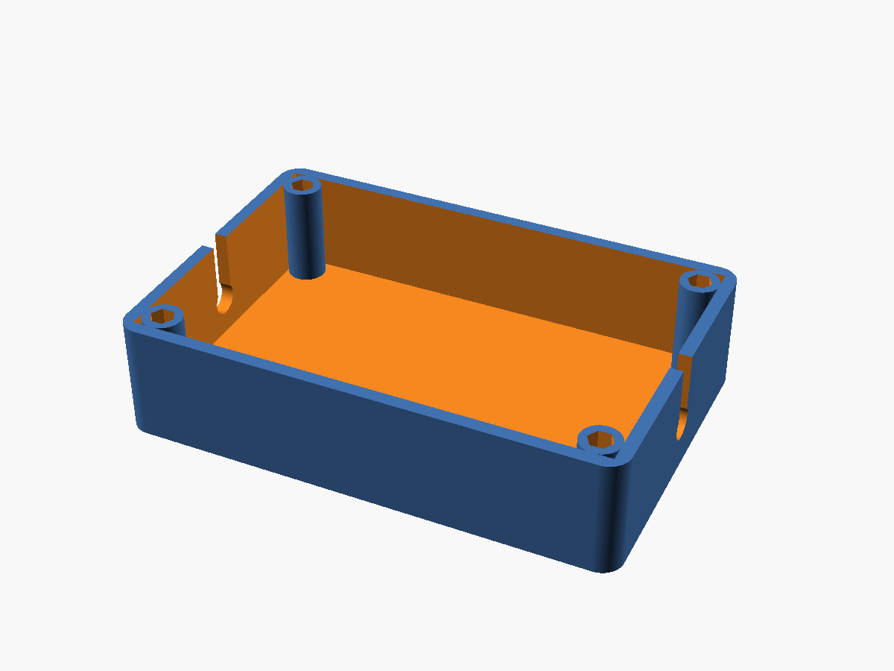
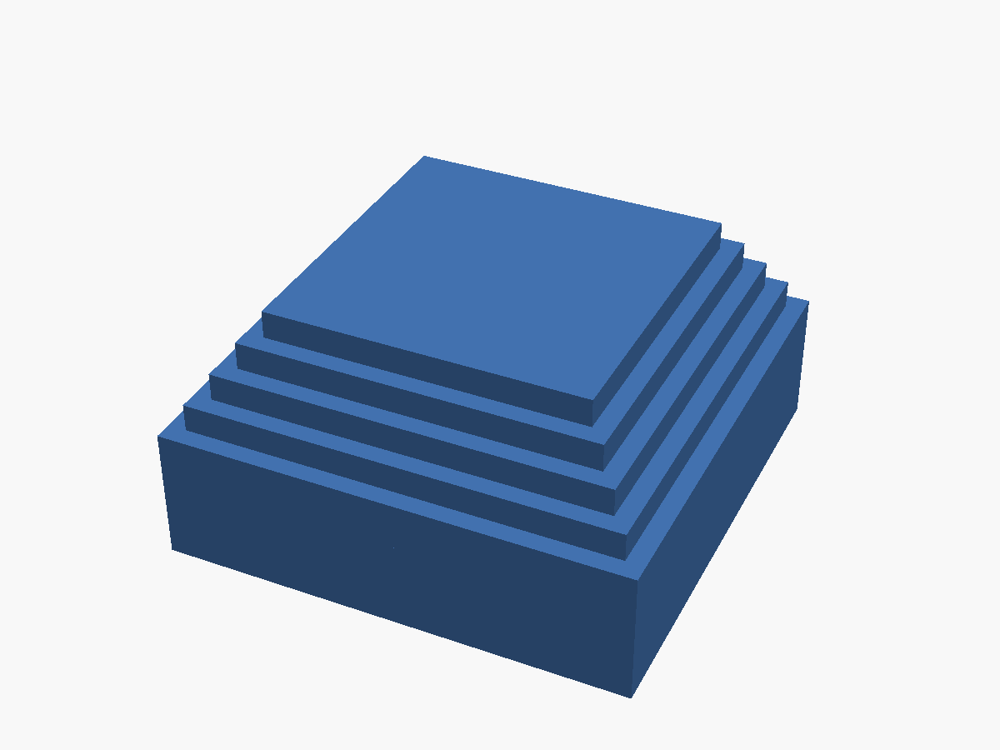
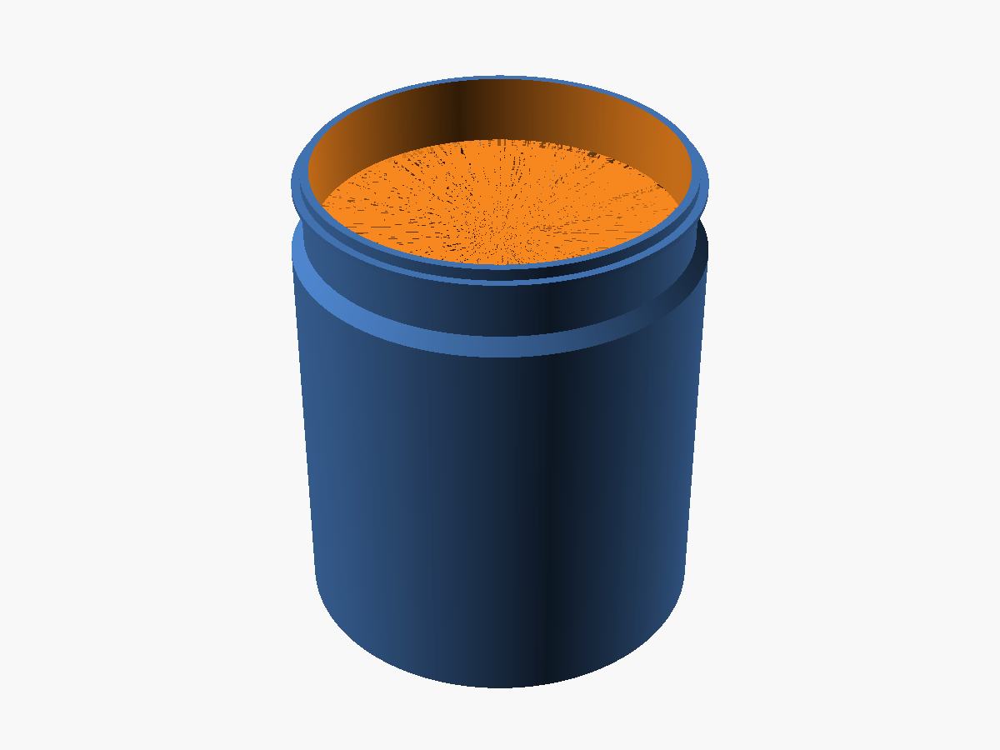
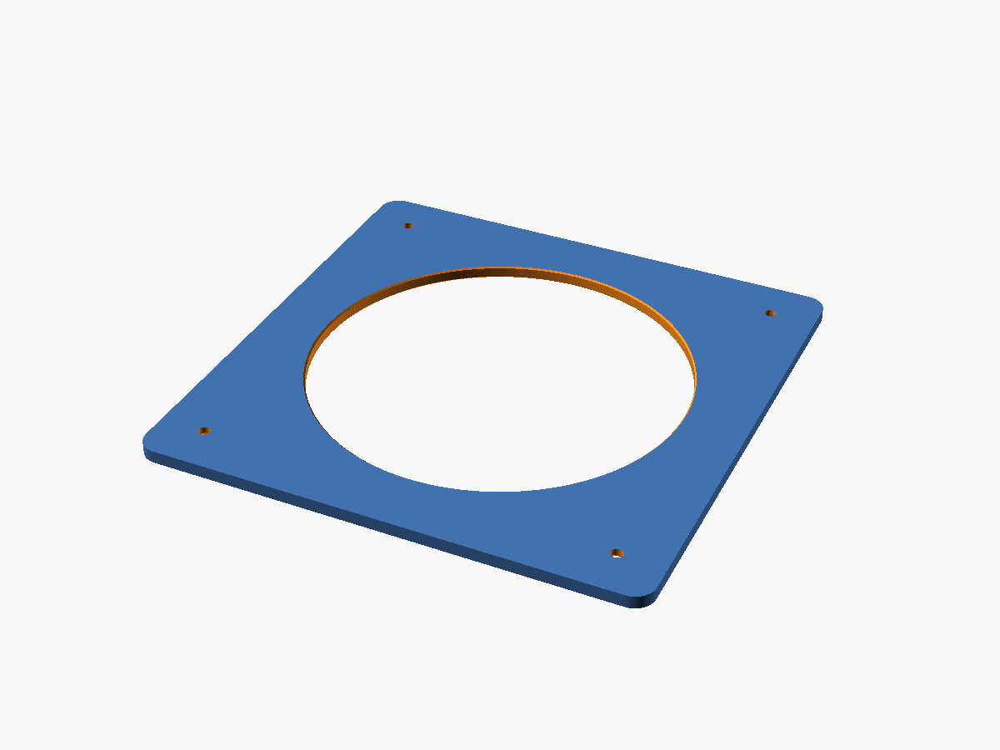

# 3D Print Projects

Personal repository of OpenSCAD designs for 3D-printed parts. Each subproject
under `src/` is self-contained — its own SCAD files and a `PROJECT.md`
documenting purpose, dimensions, install steps, and print settings. STLs build
automatically on push via GitHub Actions.

## Projects

| Project | Status | Description |
|---|---|---|
| [outdoor-lighting](src/outdoor-lighting/PROJECT.md) | Active | Govee outdoor light enclosure |
| [outdoor-planter](src/outdoor-planter/PROJECT.md) | Test print | Stepped-pyramid cap for 4x4 wooden planter posts |
| [patio-venting-project](src/patio-venting-project/PROJECT.md) | Design complete | Portable AC vent connector through exterior patio wall |

## Gallery

Previews are auto-rendered by CI on every push to `main` and committed
back to the repo, so they always reflect the current source.

| | |
|---|---|
| **outdoor-lighting**<br> | **outdoor-planter**<br> |
| **patio-venting — connector**<br> | **patio-venting — flange**<br> |

## Repository structure

```
3d-print-projects/
├── .github/
│   └── workflows/
│       └── build.yml         # CI: builds all .scad → .stl on push
├── src/
│   ├── outdoor-lighting/
│   │   ├── govee-enclosure.scad
│   │   └── PROJECT.md
│   ├── outdoor-planter/
│   │   ├── 4x4-post-cap.scad
│   │   └── PROJECT.md
│   └── patio-venting-project/
│       ├── connector.scad
│       ├── flange.scad
│       └── PROJECT.md
└── README.md
```

`dist/` is generated by the build, gitignored.

## Builds

### Local

OpenSCAD must be installed and on `PATH`.

```bash
# Build a single file
openscad -o flange.stl src/patio-venting-project/flange.scad

# Build everything into ./dist/, mirroring src/ structure
find src -name '*.scad' | while read f; do
  rel="${f#src/}"
  out="dist/${rel%.scad}.stl"
  mkdir -p "$(dirname "$out")"
  openscad -o "$out" --hardwarnings "$f"
done
```

### CI

`.github/workflows/build.yml` runs on every push to `main`, every PR, and
every tag matching `v*`. It walks `src/` for all `.scad` files, builds each
into `dist/` (mirroring directory structure), and uploads the results as
artifacts with 90-day retention. On tag push it also attaches the STLs to a
GitHub Release.

To grab the latest builds: Actions → most recent run → Artifacts → download.

## Adding a new project

1. Create `src/<project-name>/`
2. Add `.scad` files for each printable part (one part per file)
3. Add `PROJECT.md` covering purpose, key dimensions, install sequence, print
   settings, and design history
4. Push — CI builds automatically, no workflow edits needed

## OpenSCAD conventions

Patterns used consistently across projects:

- **`$fn = 360`** for parts where surface curvature is visible at print scale —
  yields ~1.3mm segments at common diameters, smooth enough for most prints.
- **Parameters at the top of each file** with units in inline comments. Test
  variants (e.g., shorter test prints) live as parameter overrides, not as
  separate files.
- **Derived values** (`base_id = base_od - 2 * wall_thickness`) computed in a
  dedicated block, not inlined into geometry — makes intent explicit and
  changes propagate cleanly.
- **Clearance parameters** named for their fit type (`slip_clearance = 0.5` for
  slide-on; `0.2` for press; `0` for forced) with a comment indicating the
  range. Tolerance test prints in PLA validate before committing to PETG.
- **No CSG hacks for inner overlap.** When two solids in a `union()` need to
  meet cleanly, give them at least 0.1mm Z-overlap; when subtracting an inner
  bore, extend the cutter 0.1mm beyond both faces. Never rely on coincident
  surfaces — the slicer will create artifacts.

## License

[Apache 2.0](LICENSE)